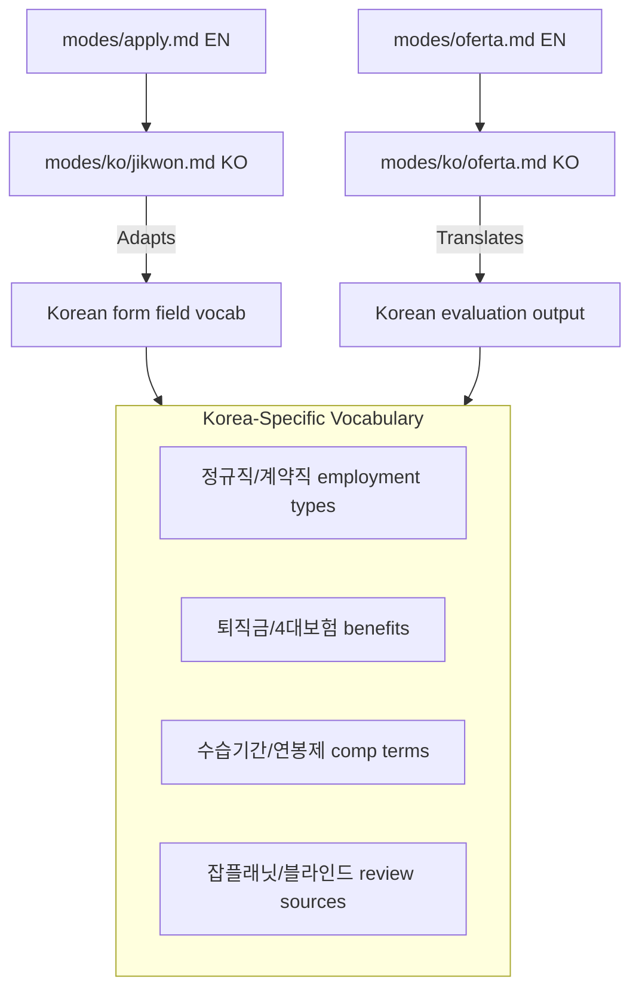

# Plan — Korea Job Portal Integration

## Current State (2026-06-18)

```mermaid
flowchart LR
    subgraph Done["Completed"]
        JK[JobKorea Provider ✓]
        SR[Saramin Provider ✓]
        JA[JobKorea Auto-Apply ✓]
        JM[JobKorea Mode ✓]
        JC[Config Templates ✓]
        KD[Korea Integration Docs ✓]
    end

    subgraph Next["In Progress"]
        CV[cv.md creation]
        TEST[Apply form live test]
    end

    subgraph Future["Planned"]
        KO[modes/ko/ Korean i18n]
        SA[Saramin Auto-Apply]
        WA[Wanted.co.kr Provider]
        RP[RocketPunch Provider]
        JP[Jobplanet Review Scraper]
        CI[CI/CD Tests]
    end

    Done --> Next
    Next --> Future
```

## Phase 1 — Foundation ✅ (Complete)

| Task | Status | Artifact |
|------|--------|----------|
| JobKorea Playwright scanner | ✅ Done | `providers/jobkorea.mjs` |
| Saramin REST API provider | ✅ Done | `providers/saramin.mjs` |
| JobKorea auto-apply script | ✅ Done | `jobkorea-apply.mjs` |
| Saramin auto-apply script | ✅ Done | `saramin-apply.mjs` |
| JobKorea integrated mode | ✅ Done | `modes/jobkorea.md` |
| Config templates | ✅ Done | `jobkorea-profile.yml.example`, `saramin-profile.yml.example` |
| Root docs update | ✅ Done | `CHANGELOG.md`, `ARCHITECTURE.md`, `SETUP.md`, `PLAN.md` |
| GitHub publish | ✅ Done | `github.com/macho715/career-ops-korea` |
| Korean README | ✅ Done | Full 한글 README rewrite |
| Safety guidelines | ✅ Done | `docs/JOBKOREA_SAFETY.md` (7원칙) |
| Site structure mapping | ✅ Done | `docs/JOBKOREA_STRUCTURE.md` |
| Chrome DevTools MCP | ✅ Done | `~/.config/opencode/opencode.json` |
| Apply script hardening | ✅ Done | headed 강제, 세션 제한, PREFLIGHT

## Phase 2 — Personalization (Current)

| Task | Priority | Depends On |
|------|----------|------------|
| Create `cv.md` | 🔴 Critical | User CV input |
| Create `config/jobkorea-profile.yml` | 🔴 High | User credentials |
| Live test: scan → evaluate → apply | 🔴 High | cv.md + profile |
| Saramin access-key registration | 🟡 Medium | User registration |

## Phase 3 — Korean Language Modes

| Task | Priority | Effort |
|------|----------|--------|
| Create `modes/ko/` directory | 🟡 Medium | 2 days |
| Translate `modes/ko/_shared.md` | 🟡 Medium | 1 day |
| Translate `modes/ko/oferta.md` | 🟡 Medium | 2 days |
| Translate `modes/ko/apply.md` | 🟡 Medium | 1 day |
| Add Korea-specific vocabulary | 🟡 Medium | 1 day |

## Phase 4 — Additional Korean Portals

| Portal | Type | Priority | Approach |
|--------|------|----------|----------|
| Wanted (원티드) | Job board | 🟡 Medium | Playwright scraper |
| RocketPunch (로켓펀치) | Job board | 🟢 Low | Playwright scraper |
| Jobplanet (잡플래닛) | Reviews | 🟢 Low | API / scraper for interview-prep |
| Catch (캐치) | Career platform | 🟢 Low | Playwright scraper |

## Phase 5 — Saramin Auto-Apply ✅ (Complete)

| Task | Priority | Status |
|------|----------|--------|
| Reverse-engineer Saramin apply form | 🟡 Medium | ✅ Saramin blocks headless → headed mode |
| Create `saramin-apply.mjs` | 🟡 Medium | ✅ Done |
| Create `config/saramin-profile.yml.example` | 🟡 Medium | ✅ Done |
| Update `AGENTS.md` with saramin mode | 🟡 Medium | ✅ Done |

## Phase 6 — Production Hardening

| Task | Priority |
|------|----------|
| Add unit tests for jobkorea/saramin providers | 🟡 Medium |
| Add `--verify` liveness for JobKorea scan results | 🟡 Medium |
| Add CI workflow for provider regression tests | 🟢 Low |
| Add `--throttle` flag for JobKorea rate limiting | 🟢 Low |
| Add Saramin code table lookup helpers | 🟢 Low |

## Risk Register

| Risk | Severity | Mitigation | Status |
|------|----------|------------|--------|
| JobKorea HTML structure changes | Medium | CSS selector fallback chain; Playwright snapshot tests | — |
| JobKorea legal action | High | Saramin API as primary; JobKorea personal-use-only warning; SAFETY.md guide | ✅ Mitigated |
| Saramin API rate limit (500/day) | Low | Cache responses; multi-keyword pagination optimization | — |
| Saramin API deprecation | Low | HTTP fallback to Playwright scraper | — |
| Korean form field changes | Medium | Dynamic field detection (not hardcoded selectors) | — |
| JobKorea headless detection | High | Force headed mode; anti-webdriver override; safety gate | ✅ Mitigated |
| JobKorea rate-based ban | Medium | 5-min interval; 5/day limit; human-like delays; jitter | ✅ Mitigated |
