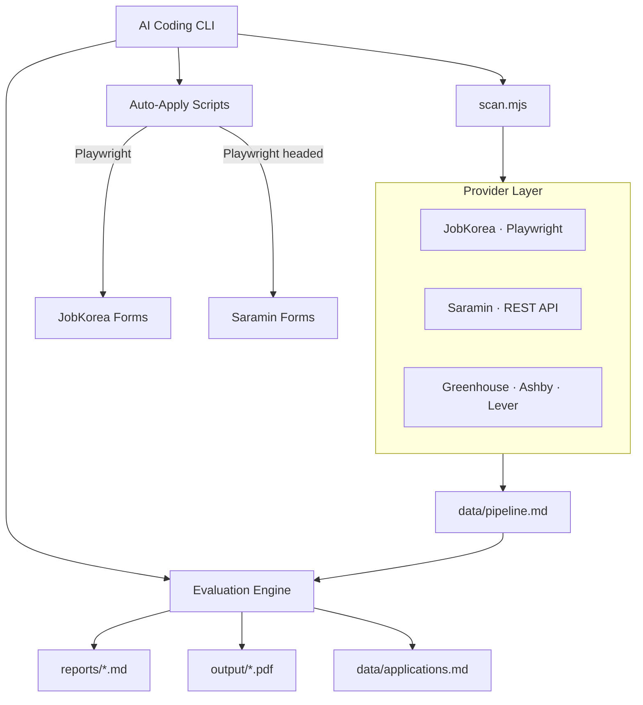

# Career-Ops Korea 🇰🇷

**AI 기반 한국 취업 자동화 시스템** — 잡코리아·사람인 스캔부터 자동지원까지.

<p align="center">
  
  
  
  
</p>

---

## 개요

career-ops는 AI 코딩 CLI 위에서 동작하는 오픈소스 취업 자동화 시스템입니다.  
이 포크는 **한국 채용 포털(JobKorea·Saramin)** 지원을 추가했습니다.

```
당신의 CV + AI CLI → 채용공고 스캔 → 6차원 평가 → 맞춤 PDF CV → 자동 지원서 작성 → 트래커 관리
```

### 지원 플랫폼

| 포털 | 스캔 방식 | 자동지원 | 법적 리스크 |
|------|----------|----------|------------|
| **Saramin (사람인)** | 공식 REST API | ✅ Playwright headed | 없음 (공식 API) |
| **JobKorea (잡코리아)** | Playwright headless | ✅ Playwright headed | 개인용으로만 사용 |
| Greenhouse / Ashby / Lever 등 | API 기반 | AI 지원서 생성 | 없음 |

---

## 빠른 시작

### 1. 설치

```bash
git clone https://github.com/macho715/career-ops-korea.git
cd career-ops-korea
npm install
npx playwright install chromium
```

### 2. CV 등록

```bash
# cv.md 파일을 생성하고 이력서를 마크다운으로 작성
# 예제: examples/cv-example.md 참조
```

### 3. Saramin 설정 (권장 — 공식 API)

```bash
# 1. 무료 access-key 발급: https://oapi.saramin.co.kr/join
# 2. portals.yml 수정
#    - name: Saramin
#      access_key: "발급받은키"
#      enabled: true

# 스캔 실행
node scan.mjs --company "Saramin"
```

### 4. JobKorea 설정

```bash
# 1. portals.yml에서 JobKorea enabled: true 로 변경
# 2. 자동지원용 프로필 생성
cp config/jobkorea-profile.yml.example config/jobkorea-profile.yml
# → ID/PW, 이름, 학력, 경력 등 입력

# 스캔 실행
node scan.mjs --company "JobKorea"

# 자동지원
node jobkorea-apply.mjs --report 42 --dry-run       # 미리보기
node jobkorea-apply.mjs --report 42 --headless=false # 실제 지원
```

---

## 14개 모드 전체 목록

| 모드 | 기능 | 실행 방법 |
|------|------|----------|
| `auto-pipeline` | JD/URL → 평가 → PDF → 트래커 자동 | JD 붙여넣기 |
| `pipeline` | pipeline.md URL 일괄 평가 | `/career-ops pipeline` |
| `oferta` | A-G 6차원 평가 (1.0~5.0) | `/career-ops` + JD |
| `ofertas` | 다중 공고 비교 | `/career-ops ofertas` |
| `pdf` | ATS 맞춤 PDF CV 생성 | `/career-ops pdf` |
| `apply` | 지원 폼 자동 작성 | `/career-ops apply` |
| `contacto` | LinkedIn 아웃리치 메시지 | `/career-ops contacto` |
| `deep` | 기업 심층 분석 | `/career-ops deep` |
| `interview-prep` | 면접 준비 (STAR+R 스토리뱅크) | `/career-ops interview-prep` |
| `training` | 교육과정 평가 | `/career-ops training` |
| `project` | 포트폴리오 프로젝트 평가 | `/career-ops project` |
| `tracker` | 지원 현황 트래커 | `/career-ops tracker` |
| `patterns` | 불합격 패턴 분석 | `/career-ops patterns` |
| `followup` | 팔로우업 캐던스 관리 | `/career-ops followup` |

---

## 한국 특화 기능

### JobKorea Provider (`providers/jobkorea.mjs`)

- Playwright headless Chromium 기반
- Tailwind React SPA 셀렉터 (2026년 6월 구조 기준)
- 다중 키워드, 지역 필터, 지터 페이지네이션
- URL 정리 + scan-history.tsv 기반 중복 제거
- 실제 검증: 90건 검색 → 22건 유니크 추출

### Saramin Provider (`providers/saramin.mjs`)

- 공식 REST API (oapi.saramin.co.kr/job-search)
- access-key 인증, 페이지네이션, 지역/직무 코드표 지원
- 500회/일 요청 제한
- JSON 응답 → 표준 Job[] 정규화

### JobKorea Auto-Apply (`jobkorea-apply.mjs`)

- 16개 필드 카테고리 자동 감지 (이름, 이메일, 전화, 생년월일, 주소, 학력, 경력, 연봉, 자기소개서, 지원동기, 포트폴리오, 기술, 자격증, 어학, 취미, 취업우대, 개인정보동의)
- `cv.md` + `reports/` 기반 한국어 자기소개서/지원동기 자동 생성
- `config/jobkorea-profile.yml` 기반 자동완성
- PREFLIGHT 검토 게이트 (민감 필드 하이라이트)
- `--dry-run` 미리보기 모드

### Saramin Auto-Apply (`saramin-apply.mjs`)

- headed Playwright 모드 (Saramin headless 차단)
- 병역사항, 학력상세, 어학시험 점수 등 추가 필드 지원
- 동일한 16개 카테고리 + PREFLIGHT 게이트

---

## 아키텍처



---

## 디렉터리 구조

```
career-ops-korea/
├── providers/          # 20+ 포털 프로바이더
│   ├── jobkorea.mjs    # JobKorea (Playwright)
│   ├── saramin.mjs     # Saramin (REST API)
│   ├── greenhouse.mjs  # Greenhouse ATS
│   └── ... 17 files
├── modes/              # 14개 AI 모드 + 9개 언어팩
│   ├── oferta.md       # 평가 엔진
│   ├── pdf.md          # PDF CV 생성
│   ├── apply.md        # 지원서 작성
│   ├── jobkorea.md     # JobKorea 통합 모드
│   └── ...
├── jobkorea-apply.mjs  # JobKorea 자동지원 스크립트
├── saramin-apply.mjs   # Saramin 자동지원 스크립트
├── scan.mjs            # 포털 스캐너
├── generate-pdf.mjs    # PDF 생성기
├── dashboard/          # Go TUI 대시보드
├── korea-integration/  # 한국 통합 문서
├── config/             # 설정 템플릿
│   ├── profile.example.yml
│   ├── jobkorea-profile.yml.example
│   └── saramin-profile.yml.example
├── docs/               # 기술 문서
├── PLAN.md             # 로드맵
└── CHANGELOG.md        # 변경 이력
```

---

## 기술 스택

| 계층 | 기술 |
|------|------|
| 런타임 | Node.js ≥ 18 |
| 브라우저 자동화 | Playwright (Chromium) |
| PDF 생성 | HTML → Playwright → PDF |
| 대시보드 | Go + Bubble Tea + Lipgloss |
| 설정 | YAML (portals.yml, profile.yml) |
| 데이터 | Markdown tables + TSV |
| AI CLI | Claude Code / OpenCode / Gemini CLI / Codex |

---

## 주의사항

### 법적 고지

- **Saramin**: 공식 API 사용 — 완전 합법, 무료
- **JobKorea**: 개인 구직 목적으로만 사용. 상업적/대량 크롤링 금지.  
  과거 경쟁사 간 스크래핑 소송에서 120억원 배상 판례 있음.
- **본 시스템은 지원서를 자동으로 제출하지 않습니다.** 모든 지원은 사용자가 최종 검토 후 수동으로 제출합니다.

### 시스템 요구사항

- `cv.md` — 이력서 (필수)
- `config/profile.yml` — 기본 프로필
- `config/jobkorea-profile.yml` — JobKorea 지원용 (자동지원 시)
- `config/saramin-profile.yml` — Saramin 지원용 (자동지원 시)
- Saramin `access_key` — [무료 발급](https://oapi.saramin.co.kr/join)

---

## 라이선스

MIT License — [career-ops 원본](https://github.com/santifer/career-ops) 기반 포크  
Built by [Santiago Fernández de Valderrama](https://santifer.io) · Korea integration by [macho715](https://github.com/macho715)

---

<p align="center">
  <sub>AI는 평가하고 추천합니다. 결정하고 행동하는 것은 당신입니다.</sub>
</p>
