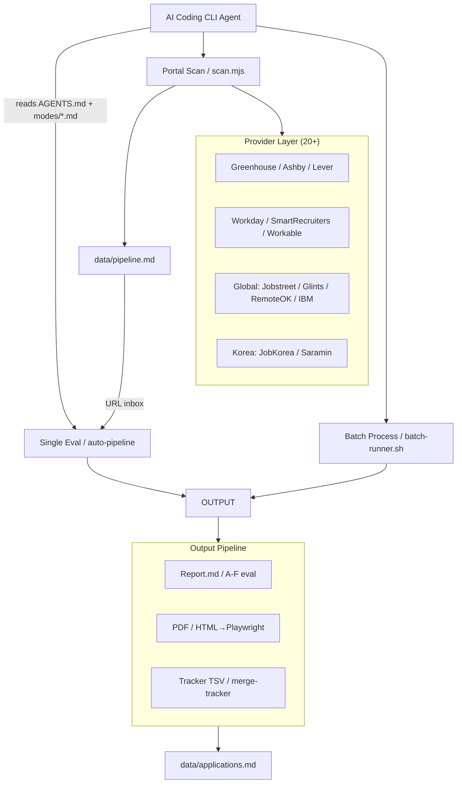
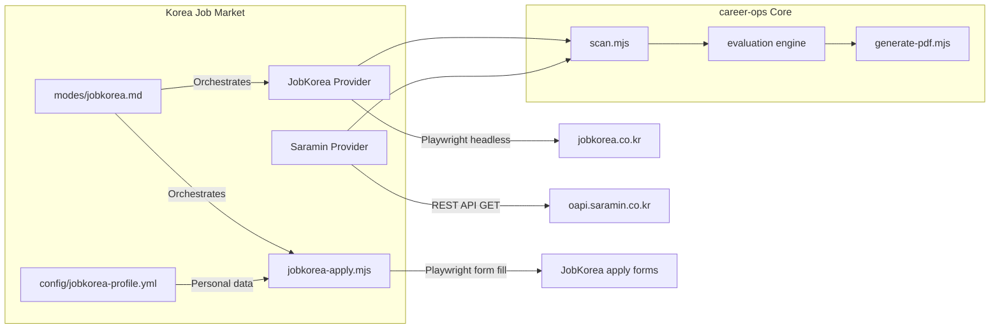

# Architecture

## System Overview



## Korea-Specific Components



### JobKorea Provider (`providers/jobkorea.mjs`)

| Aspect | Detail |
|--------|--------|
| Transport | Playwright headless Chromium |
| Context | `locale: ko-KR`, desktop Chrome UA |
| Selectors | Tailwind utility classes (`font-semibold.text-gray900`, `span.truncate`) |
| Pagination | Jittered 2-4s delay between pages |
| Dedup | URL clean (strip `listno`, `sc` params) + scan-history.tsv |
| Rate limit | None (human-like cadence) |

### Saramin Provider (`providers/saramin.mjs`)

| Aspect | Detail |
|--------|--------|
| Transport | HTTP GET (no browser overhead) |
| Auth | `access-key` query parameter (free registration) |
| Endpoint | `https://oapi.saramin.co.kr/job-search` |
| Rate limit | 500 requests/day |
| Code tables | Location (`loc_cd`), job type, education, industry |

### JobKorea Auto-Apply (`jobkorea-apply.mjs`)

| Phase | Description |
|-------|-------------|
| Login | Credentials from `jobkorea-profile.yml`, CAPTCHA detection |
| Navigate | `page.goto(jobUrl)`, apply button detection |
| Detect | `page.evaluate()` — 16 field categories (name, email, phone, birth, education, career, salary, self_intro, motivation, portfolio, skills, license, language, hobby, preferential, consent) |
| Fill | `resolveFieldValue()` → Playwright `fill()` / `selectOption()` / `check()` |
| Preflight | Full field-value table display, warning flags for sensitive fields |
| Submit | User-confirmed submission + tracker recording |

## Evaluation Flow (Single Offer)

1. **Input**: User pastes JD text or URL
2. **Extract**: Playwright/WebFetch extracts JD from URL
3. **Classify**: Detect archetype (1 of 6 types)
4. **Evaluate**: 6 blocks (A-F):
   - A: Role summary
   - B: CV match (gaps + mitigation)
   - C: Level strategy
   - D: Comp research (WebSearch)
   - E: CV personalization plan
   - F: Interview prep (STAR stories)
5. **Score**: Weighted average across 10 dimensions (1-5)
6. **Report**: Save as `reports/{num}-{company}-{date}.md`
7. **PDF**: Generate ATS-optimized CV (`generate-pdf.mjs`)
8. **Track**: Write TSV to `batch/tracker-additions/`, auto-merged

## Batch Processing

The batch system processes multiple offers in parallel:

```
batch-input.tsv    →  batch-runner.sh  →  N × headless CLI workers
(id, url, source)     (orchestrator)       (self-contained prompt)
                           │
                    batch-state.tsv
                    (tracks progress)
```

Each worker is a headless AI CLI instance — the bundled `batch-runner.sh` supports multiple CLIs via the `--cli` flag (`--cli claude` or `--cli opencode`). See the Headless / Batch Mode table in `AGENTS.md`. Workers produce:
- Report .md
- PDF
- Tracker TSV line

The orchestrator manages parallelism, state, retries, and resume.

## Data Flow

```
cv.md                    →  Evaluation context
article-digest.md        →  Proof points for matching
config/profile.yml       →  Candidate identity
portals.yml              →  Scanner configuration
templates/states.yml     →  Canonical status values
templates/cv-template.html → PDF generation template
```

## File Naming Conventions

- Reports: `{###}-{company-slug}-{YYYY-MM-DD}.md` (3-digit zero-padded)
- PDFs: `cv-candidate-{company-slug}-{YYYY-MM-DD}.pdf`
- Tracker TSVs: `batch/tracker-additions/{id}.tsv`

## Pipeline Integrity

Scripts maintain data consistency:

| Script | Purpose |
|--------|---------|
| `merge-tracker.mjs` | Merges batch TSV additions into applications.md |
| `verify-pipeline.mjs` | Health check: statuses, duplicates, links |
| `dedup-tracker.mjs` | Removes duplicate entries by company+role |
| `normalize-statuses.mjs` | Maps status aliases to canonical values |
| `cv-sync-check.mjs` | Validates setup consistency |

## Dashboard TUI

The `dashboard/` directory contains a standalone Go TUI application that visualizes the pipeline:

- Filter tabs: All, Evaluada, Aplicado, Entrevista, Top >=4, No Aplicar
- Sort modes: Score, Date, Company, Status
- Grouped/flat view
- Lazy-loaded report previews
- Inline status picker
